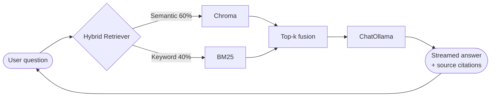
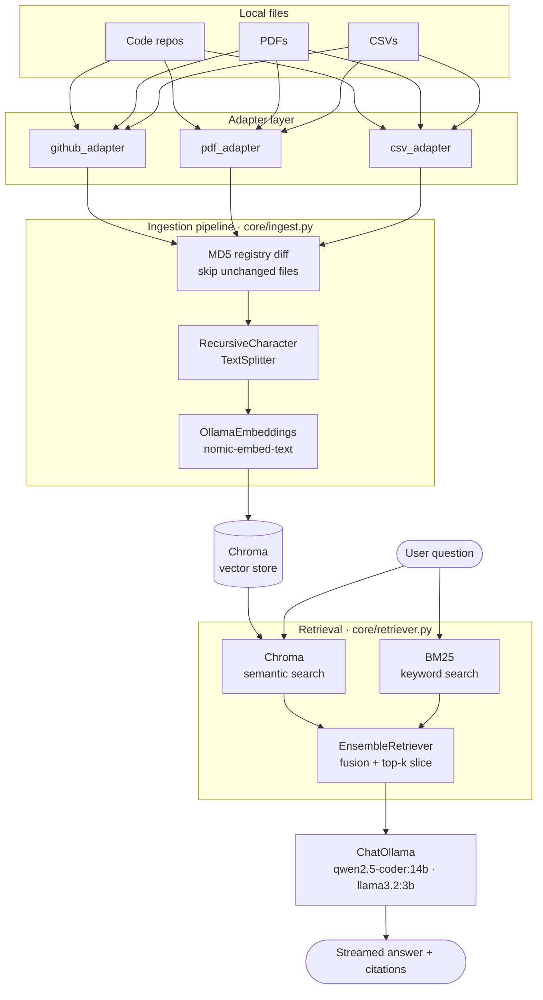

# LocalLang

A fully local, private RAG (Retrieval-Augmented Generation) system for querying codebases and documents in plain English. No data leaves your machine — no cloud APIs, no rate limits, no cost per query.

## Overview

Index a local repository or PDF directory, then ask questions about it from the terminal. Answers are grounded in your documents and include source citations.

Built on [LangChain](https://python.langchain.com/), [Ollama](https://ollama.com/), and [Chroma](https://www.tropic.io/chroma).

## Prerequisites

- Python 3.11+
- [Ollama](https://ollama.com/) running locally — install via the **official script**, not snap:

```bash
curl -fsSL https://ollama.com/install.sh | sh
```

> **WSL2 + NVIDIA GPU:** the snap package does not have access to WSL2's CUDA libraries and will fall back to CPU. The official installer auto-detects the GPU and runs ~20x faster for embeddings.

Pull the required models:

```bash
ollama pull nomic-embed-text
ollama pull qwen2.5-coder:14b   # best for code queries
ollama pull llama3.2:3b         # faster, good for testing
```

## Setup

```bash
# 1. Install dependencies
pip install -r requirements.txt

# 2. Configure
cp .env.example .env
# Edit .env — set TARGET_REPO_PATH and/or PDF_SOURCE_DIR

# 3. Index your documents
python reindex.py

# 4. Start chatting
python chat.py
```

## Configuration

All settings live in `.env` (copy from `.env.example`):

| Variable | Default | Description |
|---|---|---|
| `TARGET_REPO_PATH` | _(empty)_ | Path to a local code repository |
| `PDF_SOURCE_DIR` | _(empty)_ | Path to a directory of PDFs and/or CSVs |
| `CHROMA_PERSIST_DIR` | `./chroma_store` | Where the vector store is saved |
| `LLM_MODEL` | `qwen2.5-coder:14b` | Ollama model for answering queries |
| `EMBEDDING_MODEL` | `nomic-embed-text` | Ollama model for embeddings |
| `OLLAMA_BASE_URL` | `http://localhost:11434` | Ollama API endpoint |
| `CHUNK_SIZE` | `1000` | Token size for text splitting |
| `CHUNK_OVERLAP` | `150` | Overlap between chunks |
| `NUM_RETRIEVED_CHUNKS` | `3` | Chunks retrieved per query |
| `SEMANTIC_WEIGHT` | `0.6` | Weight for semantic (vector) search |
| `KEYWORD_WEIGHT` | `0.4` | Weight for BM25 keyword search |

## Ingestion

```bash
# Start a new RAG context (wipes existing index, then ingests from scratch)
python reindex.py

# Cap the number of documents ingested — useful for fast test runs (~5 min with 10k rows)
python reindex.py --limit 10000

# Add to or update the current context (only processes new/changed files)
python -m core.ingest

# Force re-process all files without wiping the store
python -m core.ingest --force
```

Use `reindex.py` when switching projects or sources. Use `core.ingest` to augment an existing index with new documents. The pipeline tracks processed files in `registry.json` using MD5 hashes — incremental runs skip unchanged files.

## Terminal Chat

```bash
python chat.py
```

On startup, an interactive model picker fetches all available Ollama models and lets you select with arrow keys. The cursor defaults to `LLM_MODEL` from `.env`.

The startup banner shows the active model, detected GPU, and chunk count for quick confirmation that the system is configured correctly.

Conversation history is maintained within a session — follow-up questions have full context of prior exchanges.

**Commands:**
- `exit` / `quit` — close the session
- `clear` — clear the terminal and reset conversation history

Sources are displayed after each answer. LaTeX math formatting is automatically stripped for clean terminal output.

## Project Structure

```
locallang/
├── chat.py                    # Terminal chat entry point (model picker, history, sanitizer)
├── reindex.py                 # Wipe and rebuild index from scratch
├── config.py                  # Configuration (reads from .env)
├── generate_sample_data.py    # Generates mock sales CSV for testing
├── requirements.txt
├── .env.example
├── core/
│   ├── ingest.py              # Ingestion pipeline orchestrator
│   ├── retriever.py           # Hybrid semantic + BM25 retriever
│   ├── chain.py               # LLM prompt, conversation history, streaming
│   └── registry.py            # MD5-based file change tracking
├── adapters/
│   ├── github_adapter.py      # Local repo / code file loader
│   ├── pdf_adapter.py         # PyMuPDF PDF loader
│   └── csv_adapter.py         # CSV loader — one document per row
└── sample_docs/               # Gitignored — drop test PDFs and CSVs here
```

## Performance Tips

- Use `llama3.2:3b` during development for fast responses; switch to `qwen2.5-coder:14b` for production quality
- Lower `NUM_RETRIEVED_CHUNKS` to reduce time-to-first-token
- Set `OLLAMA_MAX_LOADED_MODELS=2` in your environment before starting Ollama to keep both the embedding model and LLM loaded simultaneously
- Install Ollama via the official script (not snap) for GPU support on WSL2 — snap runs sandboxed and cannot access CUDA libraries
- On an RTX 5080, nomic-embed-text embeds at ~130 chunks/sec on GPU vs ~6 chunks/sec on CPU
- Chroma enforces a max upsert batch size of 5461 — the pipeline batches in groups of 5000 automatically

## Architecture

### Chat loop



### System architecture


